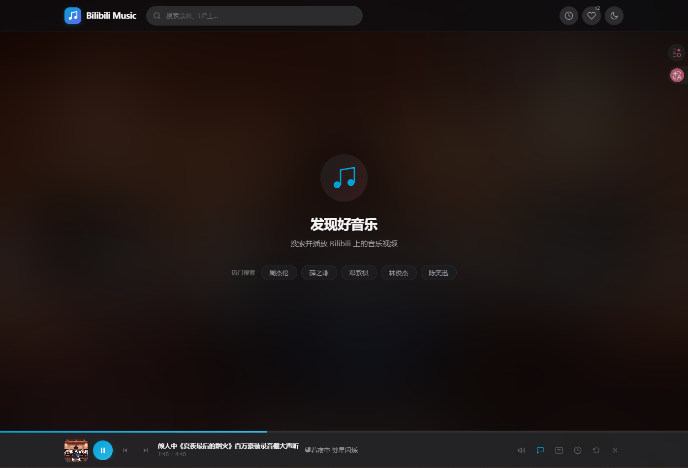
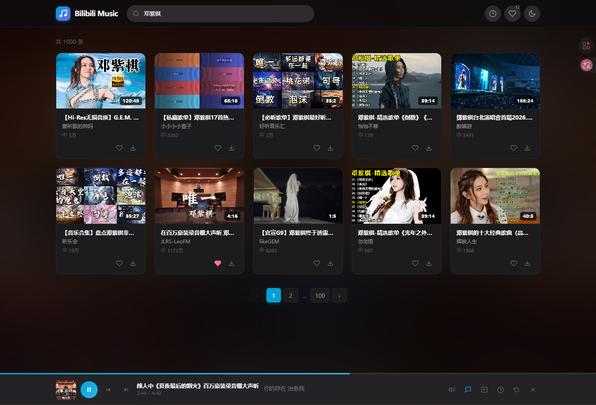
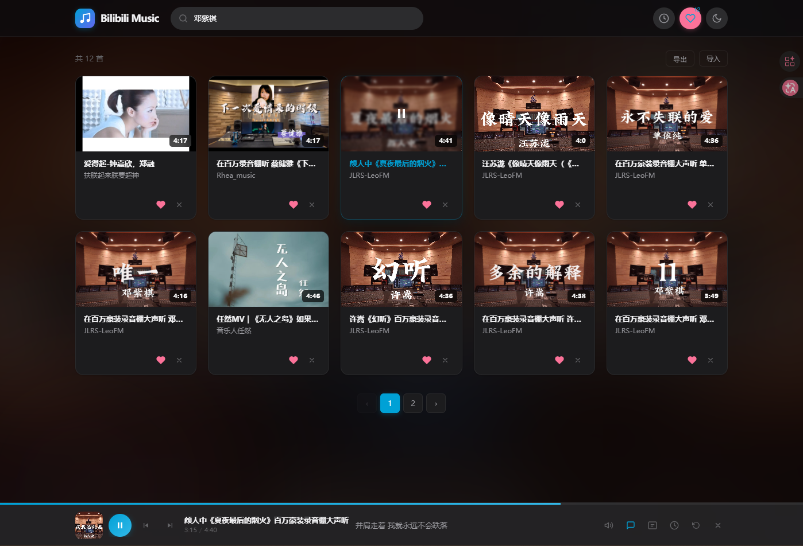
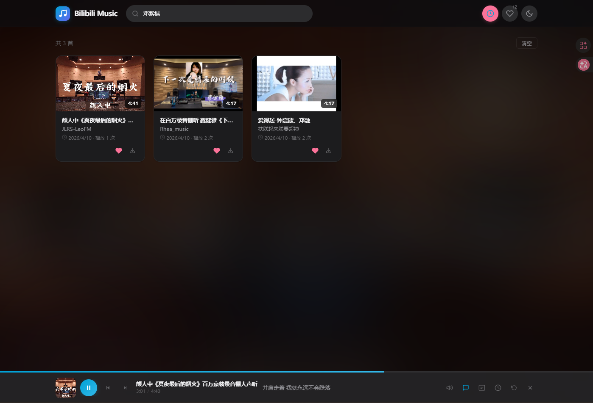
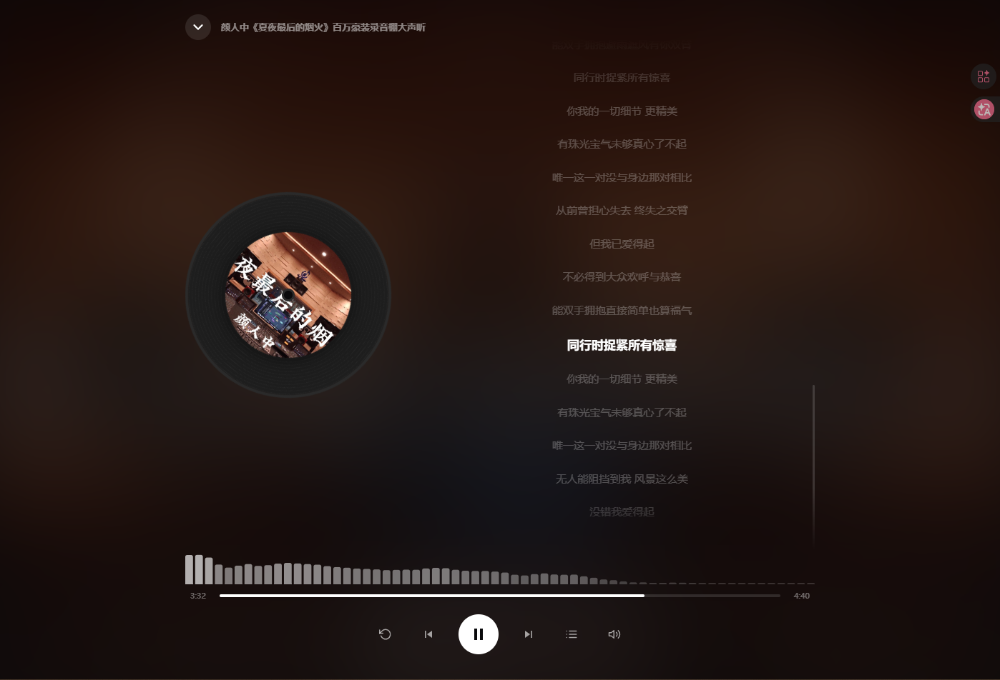

# Bilibili Music

一个基于 Flask 的在线音乐播放器，搜索并播放 Bilibili 上的音乐视频，支持歌词同步、音频缓存、下载转换等功能。

## 功能特性

- **在线播放** — 搜索 Bilibili 视频，直接在线播放音频
- **歌词同步** — 自动匹配网易云音乐歌词，实时滚动
- **音频缓存** — 基于 IndexedDB 缓存已播放歌曲，二次播放秒开
- **下载转换** — 支持下载视频并转换为 MP3（320kbps）
- **播放详情** — 全屏播放器，唱片旋转 + 音频可视化 + 歌词滚动
- **桌面歌词** — 可拖拽的悬浮歌词窗口，跟随播放同步
- **播放记录** — 自动记录播放历史，显示播放次数
- **收藏管理** — 收藏歌曲，支持导入/导出
- **搜索历史** — 记录搜索关键词，快速重复搜索
- **定时关闭** — 支持 15/30/45/60 分钟定时和播完关闭
- **封面背景** — 播放时封面模糊背景，沉浸式体验
- **键盘快捷键** — 空格播放、方向键切歌、上下调音量等
- **MediaSession** — 系统通知栏显示歌曲信息和控制
- **主题切换** — 浅色/深色模式，圆形扩散动画
- **播放模式** — 顺序播放、单曲循环、随机播放

## 截图预览

### 首页



### 搜索页面



### 我的收藏



### 播放记录



### 播放详情



## 快速开始

### 环境要求

- Python 3.8+
- ffmpeg（下载转换功能需要）

### 安装依赖

```bash
git clone https://github.com/hoooooooooong/bilibili-music.git
cd bilibili-music
pip install -r requirements.txt
```

### 启动服务

```bash
python main.py --web
```

浏览器访问 http://localhost:5000 即可使用。

### 指定端口

```bash
python main.py --web --port 8080
```

### 命令行模式

```bash
python main.py 晴天
python main.py -o ./my_music 周杰伦 稻香
```

## 键盘快捷键

| 按键 | 功能 |
|------|------|
| `Space` | 播放 / 暂停 |
| `←` | 上一曲 |
| `→` | 下一曲 |
| `↑` | 音量 +5 |
| `↓` | 音量 -5 |
| `Shift + ←` | 快退 5 秒 |
| `Shift + →` | 快进 5 秒 |
| `M` | 静音 / 取消静音 |
| `L` | 切换歌词面板 |
| `Esc` | 关闭详情页 |

## 技术栈

| 层级 | 技术 |
|------|------|
| 后端 | Flask, requests, yt-dlp, ffmpeg |
| 前端 | HTML5, CSS3, JavaScript (ES6+) |
| 存储 | localStorage, IndexedDB |
| 音频 | Web Audio API, MediaSession API |
| 歌词 | 网易云音乐 API |

## 项目结构

```
bilibili-music/
├── main.py              # Flask 应用入口（Web + CLI 双模式）
├── searcher.py          # Bilibili 搜索模块
├── downloader.py        # 视频下载模块（yt-dlp）
├── converter.py         # 音频转换模块（ffmpeg）
├── lyrics.py            # 歌词获取模块（网易云音乐）
├── config.py            # 全局配置
├── requirements.txt     # Python 依赖
├── templates/
│   └── index.html       # 前端页面
├── static/
│   ├── css/style.css    # 样式
│   └── js/app.js        # 交互逻辑
└── IMG/                 # 截图
```

## License

MIT
